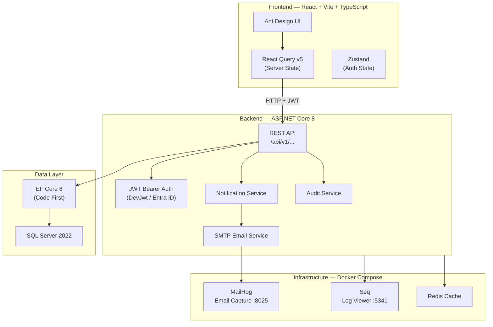
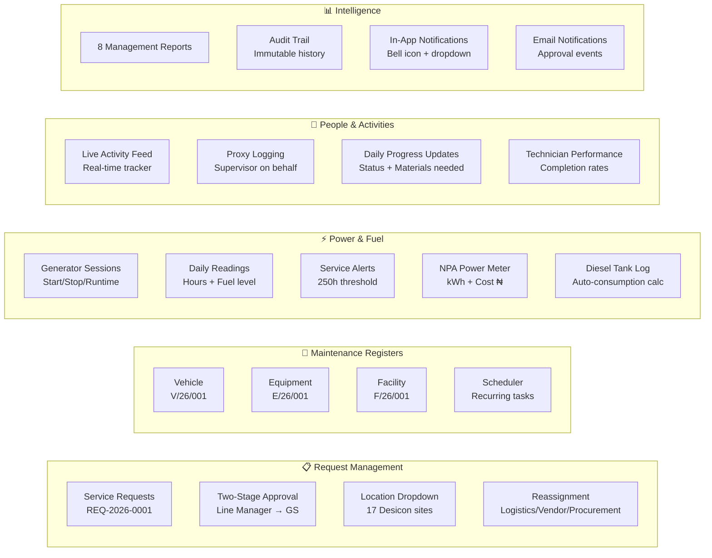
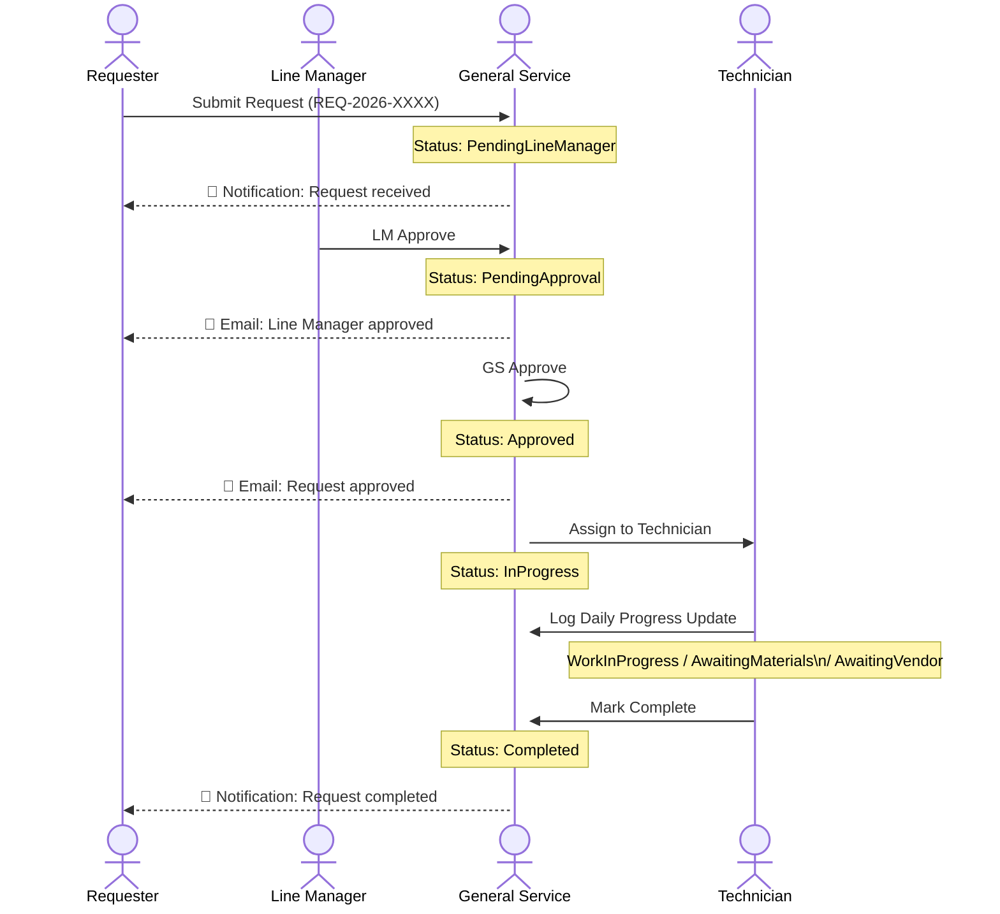
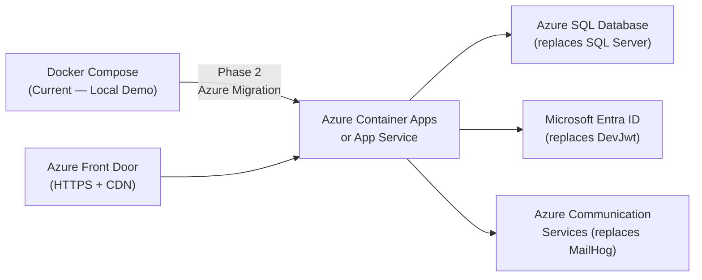

# GenService — General Service Management Platform

> **Desicon Group** | Internal Operational Management System  
> A fully integrated, web-based platform for automating General Service department operations — from request management and maintenance tracking to generator monitoring, fuel accountability, and management reporting.

---

## Overview

The General Service Management Platform replaces manual spreadsheets, verbal communication, and disconnected email workflows with a **single centralised system** that provides real-time operational visibility across all Desicon Group locations.

The platform covers every aspect of General Service operations:

- **Service Request Management** — staff raise requests, line managers approve, General Service executes
- **Vehicle, Equipment & Facility Maintenance** — three dedicated maintenance registers (V/26/001, E/26/001, F/26/001)
- **Staff Activity Tracking** — live feed of technician assignments with proxy logging support
- **Generator & Power Monitoring** — daily readings, service alerts, NPA meter tracking, electricity cost calculation
- **Diesel & Fuel Management** — tank level tracking with automatic consumption calculation
- **Comprehensive Reporting** — 8 report types for weekly management review meetings
- **Audit Trail** — every status change, approval, and assignment is immutably logged

---

## System Architecture



---

## Module Architecture



---

## Data Flow — Request Lifecycle



---

## Tech Stack

| Layer | Technology |
|---|---|
| **Frontend** | React 18, TypeScript (strict), Vite 5 |
| **UI Library** | Ant Design v6 |
| **State Management** | React Query v5 (server), Zustand (auth) |
| **Charts** | Recharts |
| **Backend** | ASP.NET Core 8, C# 12 |
| **ORM** | Entity Framework Core 8 |
| **Database** | SQL Server 2022 |
| **Authentication** | JWT Bearer (dev) / Microsoft Entra ID (prod) |
| **Email** | SMTP → MailHog (dev) / SendGrid (prod) |
| **Container** | Docker + Docker Compose |
| **Logging** | Seq structured log viewer |

---

## Modules

### 1. Request Management
- Staff submit requests through a self-service portal
- Requests categorised: Maintenance, Faulty Asset, Accommodation, Diesel, Weekend Access, Store Items, etc.
- **Two-stage approval**: Line Manager → General Service review
- Reassignment to Logistics, Vendors, or Procurement
- Location dropdown for all 17 Desicon sites
- Statuses: Open → Pending Line Manager → Pending GS Approval → Approved → In Progress → **Awaiting Spares** / **Awaiting Funds** / **Reassigned** → Completed

### 2. Vehicle Maintenance Register (V/26/001)
- Initiated by Logistics/Drivers, tracked by General Service
- Status flow: Pending → Approved → In Workshop → Completed
- Tracks: vehicle registration, workshop name, days open
- **Long-standing alert**: vehicles in workshop > 7 days
- Daily progress updates with proxy logging support

### 3. Equipment Maintenance Register (E/26/001)
- Covers generators, air conditioners, UPS systems, pumps
- Tracks asset tag number, running hours, next service hour
- Status: Pending → Approved → Ongoing → Awaiting Spares/Funds → Completed

### 4. Facility Maintenance Register (F/26/001)
- Covers electrical, plumbing, civil works, painting, tank washing
- Tracks end user, location, room/flat, actioned by (staff or third party)
- Full work-done documentation with contractor details

### 5. Maintenance Scheduler
- Planned recurring maintenance: Fumigation, Generator Servicing, Tank Washing, HVAC, Fire Safety
- Categories: Equipment | Vehicle | Facility
- Auto-advance NextDueAt on completion (e.g., +30 days for monthly tasks)
- Overdue alerts with 2-level banner

### 6. Staff Activity Tracker
- Live feed of technician assignments, refreshing every 15 seconds
- Proxy logging: supervisors can log on behalf of field technicians
- Activity categories: Maintenance, Repair, Inspection, Delivery, Generator Work, Electrical, Plumbing
- Daily progress logs linked to specific requests

### 7. Technician Performance Dashboard
- Per-technician KPIs: assigned, in progress, completed, pending
- Completion rate progress bar (colour-coded green/amber/red)
- Today / This Week / This Month activity log counts
- Blockers visible: Awaiting Materials, Awaiting Vendor

### 8. Generator & Power Monitoring
- **Generator Sessions**: start/stop events with runtime and fuel consumed
- **Daily Readings**: cumulative meter hours, fuel level, today's run hours
- **Service Alerts**: configurable threshold (default 250h) with visual progress bar
- **NPA Power Meter**: daily kWh readings with auto-calculated units consumed and ₦ electricity cost
- Fleet Overview cards with per-generator status at a glance

### 9. Diesel & Fuel Management
- **Bulk Diesel Records**: Purchase + Internal Consumption (formerly Dispensed) + Transfer
- **Diesel Tank Log**: daily tank level readings with **automatic consumption calculation** (Previous − Current)
- Cost per litre field for automatic consumption cost calculation
- Stock estimate tracking across all locations

### 10. Reporting & Analytics (8 report types)
| Report | Contents |
|---|---|
| Request Reports | Volume, completion rate, trend, top requesters |
| Maintenance | Schedule compliance, overdue, category breakdown |
| Fuel & Power | Runtime hours, outages, diesel spend |
| Vehicle Maintenance | Status breakdown by type and location |
| Facility Maintenance | By work type and end user/department |
| Generator Report | Fleet status, run hours trend, service alerts |
| Technician Activity | Performance summary, completion rates, blockers |
| Accommodation | All accommodation requests with approval status |

### 11. Notifications
- **In-app bell icon** — real-time unread count, dropdown with last 15 notifications
- **Email notifications** (via MailHog in dev) on: submission, LM approval, GS approval, rejection, completion
- Notifications targeted by role (Management vs Requester)

### 12. Audit Trail
- Every action logged: Created, Status Changed, Approved, Rejected, Assigned, Reassigned, Completed
- Captures: who, when, old value, new value, details
- Immutable records — never updated, only inserted
- Timeline visible in every request/maintenance drawer

---

## Demo Credentials

| Email | Password | Role |
|---|---|---|
| `manager@demo.local` | `DemoManager2026!` | Department Manager (Bobby Tholath) |
| `supervisor@demo.local` | `DemoSuper2026!` | Supervisor (Emeka Okonkwo) |
| `technician@demo.local` | `DemoTech2026!` | Technician (Chukwudi Nwosu) |
| `tech2@demo.local` | `DemoTech2026!` | Technician (Grace Obi) |
| `driver@demo.local` | `DemoDriver2026!` | Driver (Bola Adeyemi) |
| `requester1@demo.local` | `DemoReq2026!` | Requester (Fatima Al-Hassan) |
| `admin@dev.local` | `Dev2026!` | System Admin |

---

## Getting Started

### Prerequisites
- [Docker Desktop](https://www.docker.com/products/docker-desktop/) 4.x or later
- Git

### Quick Start

```bash
# Clone the repository
git clone https://github.com/aihebest/genservice.git
cd genservice/Docker\ Setup

# Start everything (first run: ~5 minutes to build)
docker compose up --build

# On subsequent runs (fast — pre-compiled binary)
docker compose up
```

| Service | URL |
|---|---|
| **Platform (login here)** | http://localhost:5173 |
| **API** | http://localhost:8080 |
| **Swagger / API Docs** | http://localhost:8080/swagger |
| **Email Inbox (MailHog)** | http://localhost:8025 |
| **Log Viewer (Seq)** | http://localhost:5341 |

### Resetting to fresh demo data

```bash
docker compose down -v   # drops the database volume
docker compose up --build
```

---

## API Reference Endpoints

```
POST   /api/v1/auth/login
POST   /api/v1/auth/me

GET    /api/v1/requests
POST   /api/v1/requests
POST   /api/v1/requests/{id}/line-approve
POST   /api/v1/requests/{id}/approve
POST   /api/v1/requests/{id}/assign
POST   /api/v1/requests/{id}/reassign
PATCH  /api/v1/requests/{id}/status

GET    /api/v1/vehicle-maintenance
POST   /api/v1/vehicle-maintenance/{id}/approve
POST   /api/v1/vehicle-maintenance/{id}/dispatch
POST   /api/v1/vehicle-maintenance/{id}/complete

GET    /api/v1/equipment-maintenance
GET    /api/v1/facility-maintenance

GET    /api/v1/generator-monitoring/readings
GET    /api/v1/generator-monitoring/summary
GET    /api/v1/generator-monitoring/alerts
POST   /api/v1/generator-monitoring/readings

GET    /api/v1/power-meter
POST   /api/v1/power-meter

GET    /api/v1/diesel-tank
GET    /api/v1/diesel-tank/summary
POST   /api/v1/diesel-tank

GET    /api/v1/task-logs
POST   /api/v1/task-logs
GET    /api/v1/task-logs/performance

GET    /api/v1/notifications
PATCH  /api/v1/notifications/{id}/read
PATCH  /api/v1/notifications/read-all

GET    /api/v1/audit

GET    /api/v1/dashboard/summary
GET    /api/v1/reports/requests
GET    /api/v1/reports/maintenance
GET    /api/v1/reports/fuel
GET    /api/v1/reports/vehicle
GET    /api/v1/reports/facility
GET    /api/v1/reports/generator
GET    /api/v1/reports/accommodation
```

---

## Project Structure

```
Docker Setup/
├── backend/
│   └── src/GenService.API/
│       ├── Controllers/         # 18 API controllers
│       ├── Domain/              # EF Core entities
│       ├── Models/              # DTOs and request/response records
│       ├── Data/                # DbContext
│       ├── Services/            # Email, Notifications, Audit
│       └── Program.cs           # App bootstrap + seed data
├── frontend/
│   └── src/
│       ├── api/                 # Typed API client functions
│       ├── components/          # Shared components (TopBar, Sidebar, AuditHistory, ProgressLog)
│       ├── pages/               # Feature pages (dashboard, requests, fleet, maintenance, fuel, reports)
│       ├── store/               # Zustand auth store
│       └── types/               # All TypeScript interfaces and metadata
└── docker-compose.yml
```

---

## Deployment Roadmap

This system is built Docker-first for local demo use. The production deployment path is **Azure**:



**What changes for production:**
- `Auth:Mode = DevJwt` → `Entra ID SSO` (already structured for it)
- `ConnectionStrings:DefaultConnection` → Azure SQL connection string
- MailHog SMTP → Azure Communication Services / SendGrid
- Docker volume → Azure SQL persistent storage
- `http://localhost` → custom domain with SSL via Azure Front Door

---

## Built By

Developed for **Desicon Group** — General Service Department  
Platform design and implementation: **Aihe Best** (aihebest@gmail.com)  
Powered by **Claude** (Anthropic)

---

*This platform was designed to eliminate manual spreadsheet workflows and give the General Service team real-time operational visibility. The codebase is structured for Azure deployment when the organisation is ready to move from local Docker to cloud hosting.*
